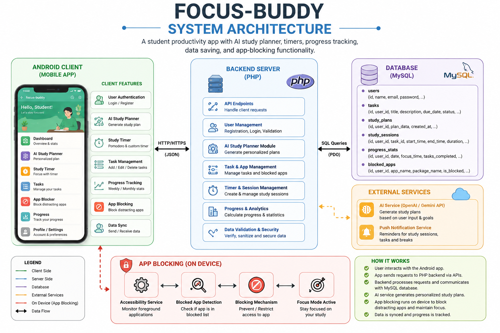
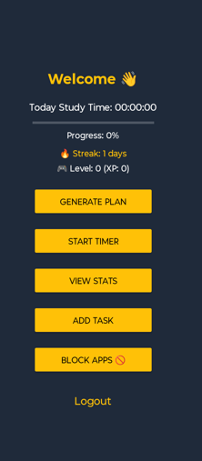
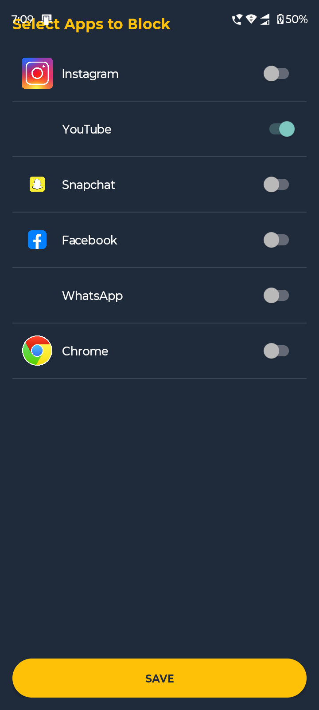
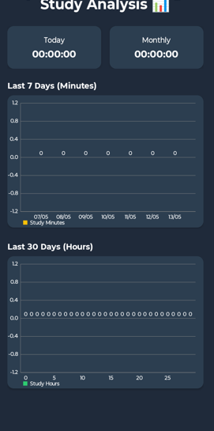

# focus-buddy
Developed a student productivity app using Android Studio with features like login/register, AI-generated study planner, study timers, weekly/monthly progress tracking, data saving, and app-blocking functionality to reduce distractions and improve focus during study sessions.
## System Architecture

## App Screenshots

### Dashboard

### AI Planner

### App Blocking

### Statistics

